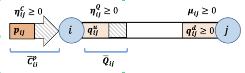
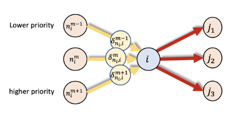
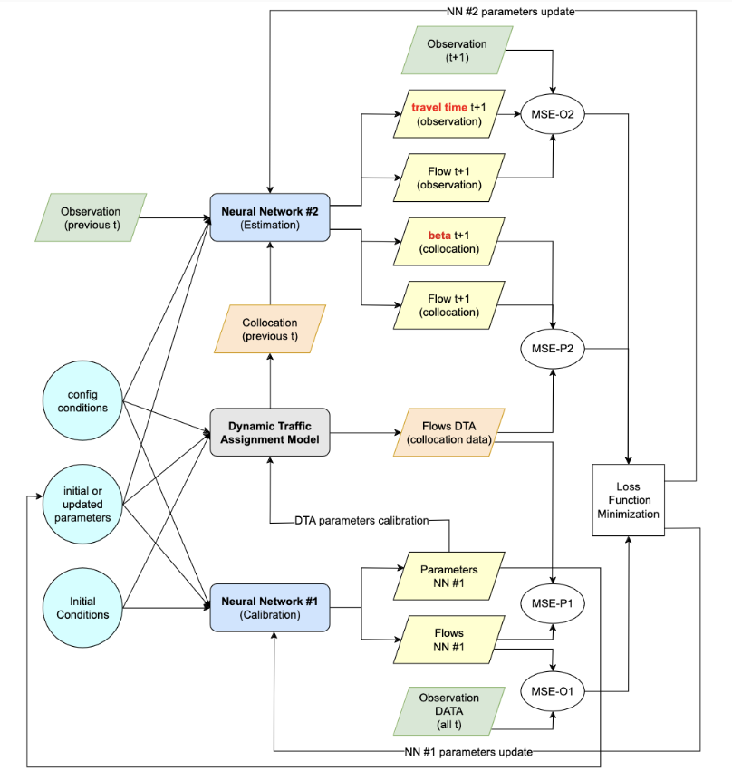

# Physics-Informed Deep Learning for Dynamic Traffic Assignment

This repository accompanies the paper:

> **"Dynamic Traffic Assignment with Physics-Informed Deep Learning"**
> Shakiba Naderian, Ohay Angah, Yiran Zhang, Xuegang (Jeff) Ban
> Department of Civil and Environmental Engineering, University of Washington

A **Physics-Informed Deep Learning (PIDL)** framework for Dynamic Traffic Assignment (DTA) that simultaneously: (1) calibrates network parameters from real-world data, (2) predicts traffic states for future time intervals, and (3) enhances the approximate travel time function used in the DTA model. The framework bridges the gap between analytical DTA models — which are mathematically rigorous but computationally expensive — and purely data-driven approaches, which lack physical interpretability and require large amounts of data.

## Background

Analytical DTA models integrate two mathematically distinct components — a behavioral model for travelers' route and departure-time choices, and a traffic dynamics model (Dynamic Network Loading) — making DTA one of the most challenging problems in transportation science. While analytical models such as the Differential Complementarity System (DCS) formulation of Ban et al. provide rigorous traffic state representations, they face four key challenges:

1. **Calibration** — network parameters (free-flow travel time, capacity) must be estimated from real-world data
2. **Behavioral assumptions** — idealized traveler rationality assumptions may not hold in practice
3. **Computational burden** — the DNL procedure, especially travel time estimation, is expensive and lacks closed-form solutions
4. **Rigidity** — the mathematical formalism makes it difficult to integrate realistic, heterogeneous traffic behavior

Pure learning-based approaches (e.g., GCNNs, FFNNs) can approximate complex DTA components but are sensitive to data noise and lack physical interpretability. This project integrates the two paradigms through PIDL, using both physics-generated *collocation data* and SUMO-simulated *observation data* to train two neural networks.


## Method Overview

The framework is built on the DTA model of Ma et al. (2018), which extends a link-based continuous-time Dynamic User Equilibrium (DUE) using a **double-queue model** and a **nodal model**.

### Traffic Dynamics

Each link (i,j) is characterized by:
- Free-flow travel time τ⁰ᵢⱼ and shockwave travel time τᵚᵢⱼ
- Flow capacity C̄ᵢⱼ and queue capacity Q̄ᵢⱼ
- Inflow pᵢⱼ(t), exit flow vᵢⱼ(t), upstream queue qᵘᵢⱼ(t), downstream queue qᵈᵢⱼ(t)

Queue dynamics are governed by:

```
q̇ᵘᵢⱼ(t) = pᵢⱼ(t) − vᵢⱼ(t − τᵚᵢⱼ)
q̇ᵈᵢⱼ(t) = pᵢⱼ(t − τ⁰ᵢⱼ) − vᵢⱼ(t)
```
<p align="center">
  
  &nbsp;&nbsp;
  
</p>

**Hidden variables** μᵢⱼ(t) (withheld exit flow due to downstream congestion) and ηᵢⱼ(t) (withheld inflow due to spillback) are encoded as complementarity constraints. These are the variables that are difficult to solve analytically and are estimated by NN#2.

The approximate link travel time function used in the DTA model is:

```
τᵢⱼ(t) = τ⁰ᵢⱼ + β(qᵈᵢⱼ(t + τ⁰ᵢⱼ), μᵢⱼ, δᵢⱼ, C̄ᵢⱼ)
```

where β is an approximation that the second neural network is trained to correct via a learned scalar coefficient γ, yielding the enhanced travel time:

```
τᵢⱼ(t) = τ⁰ᵢⱼ + γ · (qᵈᵢⱼ(t + τ⁰ᵢⱼ) / C̄ᵢⱼ) · [1 + (μᵢⱼ(t + τ⁰ᵢⱼ) + δᵢⱼ(t + τ⁰ᵢⱼ)) / C̄ᵢⱼ]
```

In the case study, γ converges to **1.48**, meaning the standard DTA travel time approximation underestimates real-world delay by approximately this factor.


### NN#1 — Calibration Network (`DNNCal`)

Takes the network structure and initial link conditions as input and predicts all traffic flows across all time instances. Trained by comparing outputs against both observation data (SUMO) and collocation data (DTA) for multiple demand scenarios.

**Loss function:**

```
Loss(θ₁, h) = 0.5 · MSE_O1 + 0.5 · MSE_P1
```

where MSE_O1 measures error against observed (SUMO) flows and MSE_P1 measures error against collocation (DTA-generated) flows. The parameters being calibrated are τ⁰, τᵚ, and C̄. After calibration, the GEH error for inflow drops from **14.84 to 7.74** on average across all links.


### NN#2 — Prediction Network (`DNNHidden`)

A branched neural network that takes current traffic states (pᵢⱼ, vᵢⱼ, qᵈᵢⱼ, τᵢⱼ) from both collocation and observation data, and predicts the next time-window state. The network has a shared hidden body that branches into:
- A **flow head** predicting next-step pᵢⱼ, vᵢⱼ, qᵈᵢⱼ
- A **β head** predicting the congestion index, followed by a bias-free linear layer whose weight is γ — the travel time calibration coefficient

**Loss function:**

```
Loss(θ₂, γ) = α · MSE_O2 + β · MSE_P2,   α + β = 1
```

where MSE_O2 includes travel time error against SUMO observations, and MSE_P2 includes β error against DTA collocation data.


#### Training Loop

```
for each epoch:
    if epoch <= 2 × total_time:          # Phase 1: calibration (NN#1)
        write calibrated params → gamsCapa_config_and_param.gms
        call MATLAB → run DTA simulation → save dta.mat
        compute Loss(θ₁, h) → backpropagate NN#1

    else:                                # Phase 2: prediction (NN#2)
        read DTA collocation trajectory from dta.mat
        compute Loss(θ₂, γ) → backpropagate NN#2
```
<p align="center">
  
</p>

NN#1 converges to stable parameter estimates after approximately **200 iterations**. NN#2 exhibits training fluctuations due to zero-demand periods at the boundaries of the study window, which is identified as an area for future improvement.


## Repository Structure

```
Physics-Informed-Deep-Learning-for-DTA/
│
├── src/                          # Python source code
│   ├── main.py                   # Training loop and PhysicsInformedNN class
│   ├── dnn.py                    # Neural network architectures (DNNCal, DNNHidden)
│   ├── network.py                # Road network graph: nodes, edges, parameters
│   ├── logger.py                 # Training loss logger
│   └── read_results.py           # Post-training result loading and visualization
│
├── gams/                         # GAMS optimization models
│   ├── DQDUE_Priority_CapIn.gms  # Main DTA model (DQDUE formulation with capacity)
│   └── gamsSigma.gms             # Sigma (queue spillback) variable computation
│
├── matlab/                       # MATLAB simulation scripts
│   ├── run.m                     # Entry point: runs DTA, writes dta.mat
│   ├── ConvErr.m                 # Convergence error calculation for DTA iterations
│   └── WriteSigma.m              # Writes sigma values to disk for GAMS
│
├── data/
│   └── raw/
│       ├── given.mat             # Initial network parameters, topology, and bounds
│       └── obs{n}.mat            # SUMO-generated observations per demand scenario n
│
├── outputs/
│   ├── results/                  # Numeric outputs from training runs
│   │   ├── beta_phy.csv          # Physics model β (congestion index) over time
│   │   ├── p_phy.csv             # Physics model density per link
│   │   ├── p_ob.csv              # Observed density per link (SUMO)
│   │   ├── qd_phy.csv            # Physics model downstream flow per link
│   │   ├── qd_ob.csv             # Observed downstream flow per link (SUMO)
│   │   ├── v_phy.csv             # Physics model speed per link
│   │   ├── v_ob.csv              # Observed speed per link (SUMO)
│   │   ├── tt_ob.csv             # Observed travel time per link (SUMO)
│   │   └── convergence.xlsx      # Training loss convergence across iterations
│   └── plots/
│       ├── Totalloss.png         # Combined training loss curve
│       ├── Totalloss_NN#1.png    # NN#1 (calibration) loss curve
│       ├── Totalloss_NN#2.png    # NN#2 (prediction) loss curve
│       └── gamma.png             # Convergence of γ coefficient over training
│
├── experiments/
│   └── PIDL_DQ_single_weight_prev_data.zip  # Archived earlier experiment snapshot
│
├── .gitignore
└── README.md
```

## Dependencies

This project requires three separate tools installed and accessible on the same machine:

| Tool | Version | Purpose |
|---|---|---|
| Python | ≥ 3.9 | PIDL training loop |
| PyTorch | ≥ 1.12 | Neural network training (CPU or GPU) |
| NumPy / SciPy | any recent | Array operations and `.mat` file I/O |
| MATLAB | R2020a+ | DTA simulation runner, called via `matlab.engine` |
| GAMS | 29+ | DTA optimization solver |
| SUMO | any | Generating observation data (offline, pre-run) |


## Running the Model

From the repo root:

```bash
python src/main.py
```

The script will:
1. Load the network from `network.py` and observations from `data/raw/`
2. Run **Phase 1** — NN#1 calibration for `2 × total_time` epochs. Each epoch writes parameters to `gamsCapa_config_and_param.gms`, calls MATLAB to simulate the DTA, reads back collocation data, and minimizes the combined observation + physics loss
3. Switch to **Phase 2** — NN#2 prediction for the remaining epochs, training on both collocation and observation trajectories to refine flow prediction and learn γ
4. Save calibrated parameters to `output/params.mat`

Training is CPU/GPU agnostic — a CUDA device will be used automatically if available.

> **Note:** Each training iteration calls a MATLAB engine and a GAMS solve. Training is intentionally compute-heavy — expect several minutes per epoch. NN#1 typically converges around 200 iterations.


## Outputs

| Output | Location | Description |
|---|---|---|
| `params.mat` | `output/` | Calibrated τᵚ and C̄ per link after NN#1 training |
| `dta.mat` | `data/` | DTA simulation state (overwritten each iteration) |
| `loss_cal.csv` | `output/` | NN#1 loss per epoch |
| `log{iter}_NN1.txt` | root | Per-iteration NN#1 log (obs loss, physics loss, total) |
| `log{iter}_NN2.txt` | root | Per-iteration NN#2 log (obs loss, physics loss, γ value) |
| `*_phy.csv`, `*_ob.csv` | `outputs/results/` | Physics vs. observed traffic state comparisons |
| `Totalloss*.png`, `gamma.png` | `outputs/plots/` | Training loss curves and learned γ trajectory |


## Results

### Calibration (NN#1)

GEH calibration error before and after NN#1 training, averaged over 15-minute intervals:

| Link | Inflow (before) | Inflow (after) | Outflow (before) | Outflow (after) | Queue (before) | Queue (after) |
|---|---|---|---|---|---|---|
| 1 | 15.86 | 4.91 | 13.35 | 5.86 | 10.73 | 7.64 |
| 2 | 14.65 | 5.41 | 13.91 | 6.93 | 11.98 | 10.31 |
| 3 | 14.59 | 6.33 | 14.04 | 8.82 | 10.45 | 10.33 |
| 4 | 14.52 | 8.03 | 14.22 | 11.02 | 8.50 | 9.42 |
| 5 | 14.57 | 10.10 | 14.61 | 12.57 | 8.43 | 9.33 |
| 6 | 14.84 | 11.64 | 14.92 | 13.57 | 8.39 | 9.28 |
| **Average** | **14.84** | **7.74** | **14.18** | **9.80** | **9.75** | **9.38** |

Average GEH error for inflow decreases by **7.1**, outflow by **4.4**, and queue by **0.36** after calibration.

### Travel Time Calibration (NN#2)

After training on 10 random demand scenarios, the γ coefficient converges to approximately **1.48**, yielding the corrected travel time function:

```
τᵢⱼ(t) = τ⁰ᵢⱼ + 1.48 · (qᵈᵢⱼ(t + τ⁰ᵢⱼ) / C̄ᵢⱼ) · [1 + (μᵢⱼ + δᵢⱼ) / C̄ᵢⱼ]
```

This is validated on link 3 at time step 21: the DTA model estimated an additional delay of 1.5 minutes beyond free-flow, while SUMO recorded 2.27 minutes of additional delay — a ratio of 1.51, closely matching the learned γ of 1.48.

Training loss curves and γ convergence:

| NN#1 Loss | NN#2 Loss | γ Convergence |
|---|---|---|
|  |  |  |


## Citation

```bibtex
@article{naderian2023pidl_dta,
  title   = {Dynamic Traffic Assignment with Physics-Informed Deep Learning},
  author  = {Naderian, Shakiba and Angah, Ohay and Zhang, Yiran and Ban, Xuegang (Jeff)},
  year    = {2023},
  institution = {Department of Civil and Environmental Engineering, University of Washington}
}
```

## Contributers
Shakiba Naderian (naderian@uw.edu)
Ohay Angah (oangah@uw.edu)
